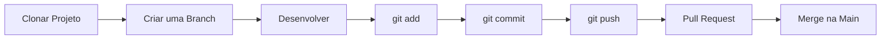

# 👾 Portfólio Landing Page — Turma 130


> Projeto desenvolvido pela **Turma 130** do curso **Desenvolvedor Front-end** do programa **Transforma-se**.

## 📖 Sobre o Projeto

Este projeto consiste no desenvolvimento de uma **Landing Page** que representa o portfólio da Turma 130.

A atividade foi proposta na **UC4**, com o objetivo de colocar em prática os conhecimentos adquiridos durante o curso, desenvolvendo uma aplicação web utilizando **HTML**, **CSS** e **JavaScript**.

Além do desenvolvimento da interface, o projeto também tem como finalidade ensinar o trabalho colaborativo utilizando **Git** e **GitHub**, simulando um ambiente de desenvolvimento profissional.

---

## 🎯 Objetivos

* Praticar HTML5, CSS3 e JavaScript.
* Desenvolver uma Landing Page responsiva.
* Aprender a trabalhar em equipe.
* Utilizar Git para controle de versões.
* Utilizar GitHub para colaboração entre os integrantes.

---

## 🛠️ Tecnologias Utilizadas


<p align="center">


</p>

---

## 📄 Estrutura do Projeto

A Landing Page possui as seguintes páginas:

* 🏠 Home
* 👨‍🏫 Docente
* 📚 Grade Curricular
* 🗺️ Roadmap
* 👨‍🎓 Estudantes
* 👥 Turma

---

# 🌳 Fluxo de Trabalho da Equipe

Todos os integrantes deverão seguir o fluxo abaixo.



---

# 📥 Como Clonar o Repositório

1. Copie a URL do repositório no GitHub.

2. Abra o terminal.

3. Execute:

```bash
git clone URL_DO_REPOSITORIO
```

Exemplo:

```bash
git clone https://github.com/usuario/repositorio.git
```

4. Entre na pasta do projeto:

```bash
cd nome-do-repositorio
```

---

# 🌿 Criando uma Branch

**Nunca faça alterações diretamente na `main`.**

Cada integrante deverá criar uma branch para desenvolver sua funcionalidade.

```bash
git checkout -b feature/nome-da-sua-feature
```

Exemplos:

```bash
git checkout -b feature/home

git checkout -b feature/docente

git checkout -b feature/grade

git checkout -b feature/roadmap

git checkout -b feature/estudantes
```

---

# 🔄 Trocando de Branch

Ver todas as branches:

```bash
git branch
```

Trocar de branch:

```bash
git checkout nome-da-branch
```

Exemplo:

```bash
git checkout main
```

---

# ⬇️ Atualizando o Projeto

Antes de começar a desenvolver, atualize a branch principal.

```bash
git checkout main

git pull origin main
```

Depois volte para sua branch.

```bash
git checkout feature/sua-feature
```

Atualize sua branch com as alterações mais recentes da main.

```bash
git merge main
```

---

# 💻 Desenvolvendo

Após realizar suas alterações, verifique os arquivos modificados.

```bash
git status
```

---

<br>

# ➕ Adicionando os Arquivos

Adicionar todos os arquivos modificados:

```bash
git add .
```

Ou apenas um arquivo específico:

```bash
git add index.html
```

---

# 💾 Criando um Commit

<br>

Após adicionar os arquivos:

```bash
git commit -m "Descrição da alteração"
```

Exemplos:

```bash
git commit -m "Adiciona seção Docente"

git commit -m "Corrige layout da página Home"

git commit -m "Cria página Grade"
```

---

# ☁️ Enviando para o GitHub


Primeiro envio da branch:

```bash
git push -u origin feature/sua-feature
```

Depois disso:

```bash
git push
```

---

# 🔀 Criando um Pull Request

<br>

Após o **Push**, acesse o repositório no GitHub.

Clique em:

**Compare & Pull Request**

Adicione uma descrição das alterações realizadas e envie para revisão.

A branch somente será integrada à **main** após aprovação.

---

# 📋 Resumo dos Comandos


| Comando                    | Função                        |
| -------------------------- | ----------------------------- |
| `git clone URL`            | Clonar o repositório          |
| `git branch`               | Listar branches               |
| `git checkout nome`        | Trocar de branch              |
| `git checkout -b nome`     | Criar uma nova branch         |
| `git status`               | Verificar alterações          |
| `git add .`                | Adicionar arquivos            |
| `git commit -m "mensagem"` | Criar um commit               |
| `git push`                 | Enviar alterações             |
| `git pull`                 | Atualizar o projeto           |
| `git merge main`           | Atualizar a branch com a main |

---

# 📌 Exemplo Completo


```bash
git clone https://github.com/usuario/repositorio.git

cd repositorio

git checkout -b feature/home

# Desenvolva sua funcionalidade

git status

git add .

git commit -m "Implementa página Home"

git push -u origin feature/home
```

---

# ✅ Boas Práticas

* Nunca desenvolva diretamente na `main`.
* Crie uma branch para cada funcionalidade.
* Faça commits pequenos e frequentes.
* Utilize mensagens de commit claras e objetivas.
* Atualize sua branch antes de iniciar uma nova tarefa.
* Sempre abra um Pull Request antes de solicitar a integração à `main`.
* Evite alterar arquivos de outros integrantes sem alinhamento prévio.

---
### Notas finais

Projeto desenvolvido pelos estudantes da **Turma 130** do curso **Desenvolvedor Front-end** do **Programa Transforma-se**, como atividade prática da **UC4**, aplicando conceitos de desenvolvimento web e colaboração utilizando Git e GitHub.
